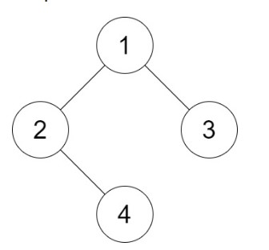
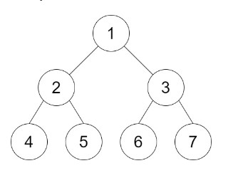

# 1530. Number of Good Leaf Nodes Pairs

## Problem Statement
You are given the root of a binary tree and an integer distance. A pair of two different leaf nodes of a binary tree is said to be good if the length of the shortest path between them is less than or equal to distance.

Return the number of good leaf node pairs in the tree.

### Examples

#### Example 1:



**Input:** root = [1,2,3,null,4], distance = 3  
**Output:** 1  
**Explanation:** The leaf nodes of the tree are 3 and 4 and the length of the shortest path between them is 3. This is the only good pair.

#### Example 2:



**Input:** root = [1,2,3,4,5,6,7], distance = 3  
**Output:** 2  
**Explanation:** The good pairs are [4,5] and [6,7] with shortest path = 2. The pair [4,6] is not good because the length of the shortest path between them is 4.

#### Example 3:

**Input:** root = [7,1,4,6,null,5,3,null,null,null,null,null,2], distance = 3  
**Output:** 1  
**Explanation:** The only good pair is [2,5].

## Solution

### Approach
To solve the problem of counting the number of good leaf node pairs in a binary tree, we need to:

1. Traverse the tree to find all leaf nodes.
2. Compute the shortest path between each pair of leaf nodes.
3. Count the pairs whose shortest path is less than or equal to the given distance.

A depth-first search (DFS) approach is useful here. The key steps in the approach are:

1. **Define a helper function to perform DFS:** This function will traverse the tree and keep track of the distances of leaf nodes from their parent nodes.
2. **Aggregate the distances at each node:** As we traverse back up the tree, we can compute the distance between leaf nodes found in the left and right subtrees.
3. **Count the good pairs:** For each node, we count pairs of leaf nodes whose distance is within the given threshold.
4. **Return the total count of good pairs.**

### Python Implementation

```python
# Definition for a binary tree node.
# class TreeNode:
#     def __init__(self, val=0, left=None, right=None):
#         self.val = val
#         self.left = left
#         self.right = right

class Solution:
    def countPairs(self, root: TreeNode, distance: int) -> int:
        self.result = 0

        def dfs(node):
            if not node:
                return []

            if not node.left and not node.right:
                return [1]

            leftd = dfs(node.left)
            rightd = dfs(node.right)

            for ld in leftd:
                for rd in rightd:
                    if ld + rd <= distance:
                        self.result += 1
            
            currentd = [d + 1 for d in leftd + rightd if d + 1 < distance]
            return currentd

        dfs(root)
        return self.result
